# Executive Summary
This document describes the data and training reference workflow. It describes the process of producing vetted model artifacts from raw data and third-party models through data validation, transformation, model training and model evaluation. 

The workflow is structured into two primary functional areas: **Data Engineering** and **Data Science**, both of which feed into a centralized **Observability & Attestations** layer.

The data lifecycle begins with the collection of data from different sources:
- **Data Ingestion**: Aggregates data from 3rd Party and Internal Sources into a **Raw Datasets** repository.
- **Data Validation**: A multi-step verification process that checks for **Data Quality & Bias**, **Compliance**, **Provenance**, and **Usage Requirements** that produces **Vetted Data**.
- **Data Transformation**: Converts validated data into **Processed Data** and **Features** (Feature Store) through a pipeline of cleaning, normalization, and labeling.

The model lifecycle focuses on the ingestion, training, and benchmarking of AI models:
- **Model Ingestion**: Imports external or 3rd party models into an **Unvetted Models** repository.
- **Model Training**: An iterative loop using features from the Data Platform and/or pre-trained models. It includes **Hyperparameter Selection**, **Training**, and **Metrics Validation**.
- **Model Evaluation**: Before graduation to a **Vetted Model**, candidates are tested against **Safety**, **Fairness**, and **Performance Benchmarks**.

Lastly, there is a transversal layer that captures logs, metrics, and attestations from every major process (Ingestion, Transformation, Training, and Evaluation). This ensures a full audit trail and lineage for both data and model artifacts.

# Table of Contents
- [Executive Summary](#executive-summary)
- [Workflow Diagram](#workflow-diagram)
- [Data Engineering Workflow](#data-engineering-workflow)
- [Data Science Workflow](#data-science-workflow)
- [Observability & Attestations](#observability--attestations)

# Workflow Diagram

---

# Data Engineering Workflow

The Data Engineering functional area manages the transition of raw data into training-ready datasets and ready to consume data.

## Data Ingestion
Data is collected from **3rd Party & Internal Data Sources** as well as **Streaming Processes**. The ingestion pipeline acts as the first entry point, consolidating these diverse sources into a dedicated **Raw Datasets** repository for further processing.

## Data Validation
Before data can be used for training, it undergoes a validation process to ensure it meets enterprise standards. This multi-step verification includes:
- **Data Quality & Bias**: Assessing the statistical health of the data and identifying potential representational imbalances.
- **Data Compliance**: Ensuring the data adheres to legal and regulatory constraints.
- **Data Provenance**: Verifying the origin and history of the dataset to ensure its integrity.
- **Usage Requirements**: Confirming the data is suitable for the specific intended AI use cases.

Successful validation promotes the raw data to **Vetted Data** status.

## Data Transformation
Vetted data is refined through a transformation pipeline to prepare it for consumption:
- **Clean**: Removing noise, duplicates, and errors.
- **Normalize**: Standardizing formats and scales across different data types.
- **Transform**: Applying complex logic to derive new insights or structures.
- **Label**: Adding annotations or metadata.

The output of this stage consists of **Processed Data** and **Features** stored in a **Feature Store**.

---

# Data Science Workflow

The Data Science functional area focuses on the development and evaluation of AI models.

## Model Ingestion
External innovation is integrated by importing **3rd Party Models** into the **Unvetted Models** repository. This allows data scientists to evaluate or fine-tune existing architectures within the governed enterprise environment.

## Model Training
Model training is an iterative process that leverages prepared features and pre-trained models:
- **Hyperparameter Selection**: Configuring the training parameters to optimize learning.
- **Model Training**: The core execution phase where the model learns from the processed data and features.
- **Metrics Validation**: Continuous assessment of training performance to guide the next iteration of hyperparameter selection.

The result of a successful training run is an artifact stored as an **Unvetted Model**.

## Model Evaluation
Before a model can be considered production-ready, it must pass through an evaluation gate to ensure safety and performance. Models are tested against:
- **Safety Benchmarks**: Evaluating for vulnerabilities, harmful outputs, or adversarial risks.
- **Fairness Benchmarks**: Ensuring the model does not exhibit discriminatory behavior.
- **Performance Benchmarks**: Measuring accuracy, latency, and throughput against target requirements.

Models that meet all criteria are graduated to the **Vetted Models** repository.

---

# Observability & Attestations

A transversal layer provides end-to-end transparency across both the data and model lifecycles.

- **Telemetry**: Every stage of the workflow Ingestion, Transformation, Training, and Evaluation emits logs, metrics, and events to a centralized system for real-time monitoring and diagnostics.
- **Audit Trail**: Process attestations are captured at each transition point, ensuring a cryptographically signed record of lineage for every vetted dataset and model artifact. This confirms exactly which data was used to train which model and how that data was validated.
